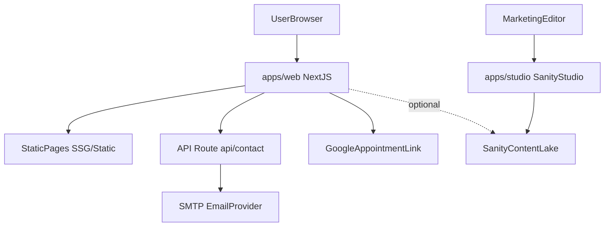

# Arquitectura — Condór Web (monorepo)

## Objetivo

Este repositorio contiene el **sitio web de marketing** de Condór, optimizado para performance/SEO, con edición híbrida (código + CMS) y captación de leads (agenda + contacto).

Principios guía:
- **Clarity > persuasion**
- **Pocos componentes, reusados**
- **Tono calmado y técnico**
- **Cero urgencia falsa**

---

## Vista general (alto nivel)

Notas:
- **Hoy** el sitio funciona sin depender de Sanity para contenido público (MVP).  
- **Sanity** queda listo para cuando quieran mover “casos”, “equipo”, “soluciones” a contenido editable.

---

## Estructura del repositorio

- `apps/web/`: Next.js 16 (App Router)
- `apps/studio/`: Sanity Studio v3
- `brand/`: assets de marca (logo, favicon, colores, link de agenda)
- `copy/`: `copies.txt` (editable para textos futuros; hoy usa defaults si está vacío)
- `case-studies/`: `case-studies.txt` (fuente local temporal para casos)

---

## apps/web (Next.js)

### Rutas principales

- `/`: Home
- `/soluciones`: listado de pilares
- `/soluciones/[slug]`: detalle por pilar (SSG)
- `/casos`: listado de casos
- `/casos/[slug]`: detalle por caso (SSG)
- `/equipo`: equipo
- `/contacto`: formulario + CTA a agenda
- `/legal/privacidad`, `/legal/cookies`: legal (borrador)
- `/sitemap.xml`, `/robots.txt`: SEO técnico
- `/api/contact`: endpoint de formulario

### Render strategy
- Mayoría de páginas: **Static / SSG** (rápidas, SEO-friendly).
- Dinámico: **`/api/contact`** (server runtime).

### Componentes clave
- `src/components/SiteHeader.tsx`: navegación + CTA + wordmark “Condór + co”
- `src/components/CoWheel.tsx`: rueda/slot rotando palabras “co:*” (Client Component)
- `src/components/SiteFooter.tsx`: navegación + legal
- `src/components/contact/ContactForm.tsx`: formulario (Client Component)
- `src/components/ui/Button.tsx`: botón/link unificado

### Config y tokens
- `src/app/globals.css`: tokens de color (CSS vars) + layout container util
- `src/app/layout.tsx`: fuentes (`next/font`) + metadata/OG
- `brand/colores.txt`: fuente de verdad “humana” de la paleta (referencia)
- `brand/link_google.txt`: URL de agenda (se usa como fallback; puede override por env)

---

## Captación de leads

### CTA “Agendar”
- Fuente: `brand/link_google.txt`
- Override: `NEXT_PUBLIC_CALENDAR_URL`

### Formulario “Contacto”
- UI: `src/components/contact/ContactForm.tsx`
- API: `src/app/api/contact/route.ts`

Protecciones:
- Honeypot (`company_website`)
- Rate limit en memoria por IP (simple, MVP)

Entrega:
- Si SMTP está configurado: envía email con nodemailer.
- Si no: responde “recibido” y deja pendiente la configuración.

---

## CMS (Sanity) — estado actual

Sanity Studio está scaffolded y con esquemas base. El frontend aún no está conectado a consultas de Sanity para el contenido público (intencional para MVP).

Ver: `docs/CONTENT_MODEL.md`.

---

## Riesgos y decisiones técnicas

- El rate-limit en memoria funciona para un solo runtime; en serverless multi-instancia no es global. Si se vuelve crítico: usar Redis/Upstash/Cloudflare.
- OG image es placeholder; cuando tengan assets, agregar `public/og-image.png`.

Ver: `docs/DECISIONS.md`.

